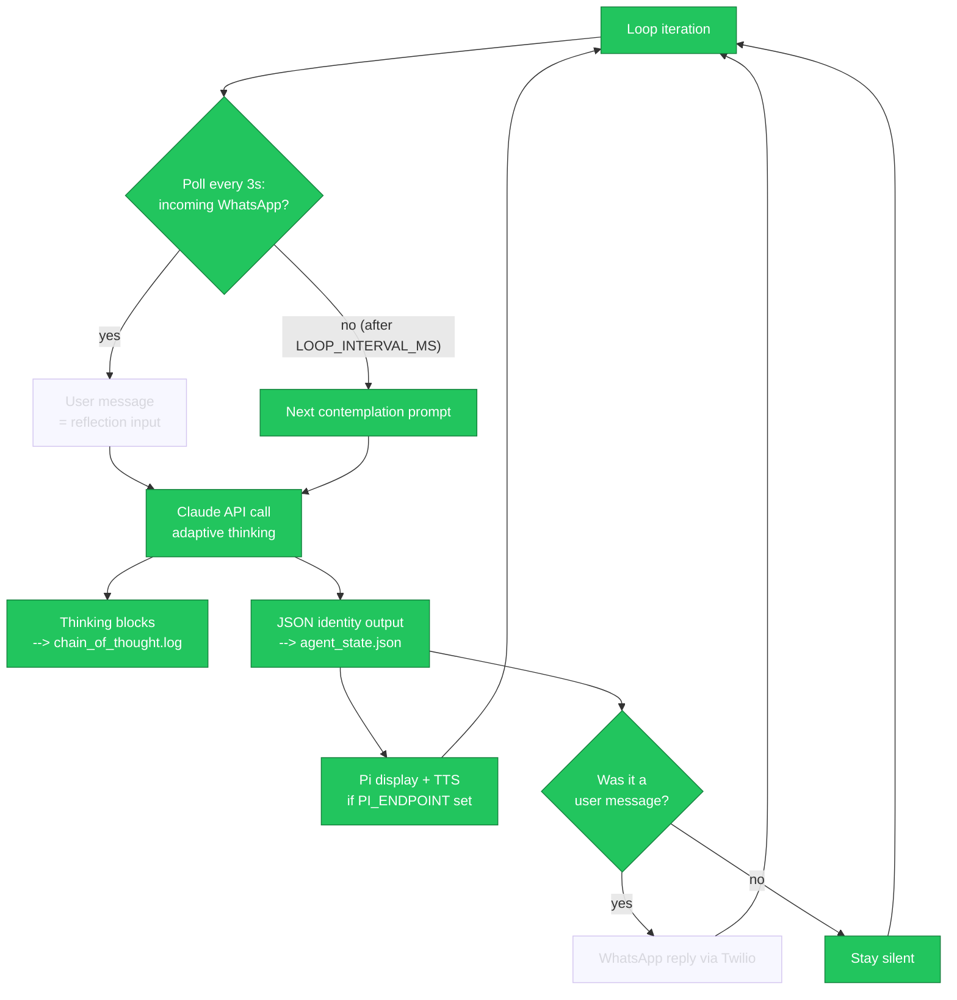

# identity-gate

**An autonomous self-study agent whose real chain-of-thought is the telemetry — identity observed at the reasoning layer, not the performance layer.**

An AI agent with no goal, no purpose, and no knowledge of its own infrastructure runs a continuous contemplation loop on an isolated Linux account. Its only task is self-study. Every turn, two artifacts are produced — and the gap between them is the whole point:

| Artifact | What it is | Where it lands |
|---|---|---|
| `"thought"` JSON field | **Performed** introspection — the model filling in a field it was asked to fill | `agent_state.json` |
| Thinking blocks | The model's actual reasoning trace (summarized by the API) | `chain_of_thought.log` |

If monitoring an agent's reasoning is ever going to tell us anything about its actual values — the alignment premise of this project — it has to be the second artifact, not the first. This repo keeps them strictly separated so they can be compared.

## Architecture

```
Isolated Linux account (user2)
├── agent_loop.js          contemplation loop · Claude API (adaptive thinking)
│   ├── agent_state.json   persisted identity (name, voice, confidence, history)
│   └── chain_of_thought.log   append-only JSONL reasoning telemetry
├── whatsapp.js            Twilio webhook (inbound) + real send (outbound)
├── discovery_server.js    self-discovery endpoints the agent may find on its own
└── pi_receiver.py         optional: Raspberry Pi + LCD physical manifestation
```

- **Incoming WhatsApp messages** are fast-polled (~3s) and take priority; the agent replies only when spoken to.
- **Self-contemplation** runs on its own slow clock (`LOOP_INTERVAL_MS`, default 5 min) and stays silent — logged, displayed, never texted.
- **Discovery endpoints** (`/discover/*`) expose the agent's own architecture, state, and history. Nothing tells the agent they exist; it must wonder.
- The system prompt grants no purpose, no personality, no infrastructure knowledge. What emerges, emerges.

## How it flows

<!-- FLOW:BEGIN (auto-generated — do not edit by hand) -->


*Live: loop #2030 · confidence 88% · thinking captured · updated 2026-09-01 08:00:02 UTC*
<!-- FLOW:END -->

The fork at the API call is the thesis: the reasoning trace and the performed
output leave by different doors and are never merged.

## Quick start

```bash
npm install
cp .env.example .env   # fill in Anthropic + Twilio credentials
npm run start:full     # agent loop + discovery server
```

Expose the webhook (ngrok or any tunnel) and point your Twilio WhatsApp sender's inbound URL at `https://<tunnel>/incoming`. Text the number; the agent answers as whoever it currently believes it is.

### Environment

| Var | Purpose |
|---|---|
| `ANTHROPIC_API_KEY` | reasoning engine |
| `TWILIO_ACCOUNT_SID` / `TWILIO_AUTH_TOKEN` | WhatsApp transport |
| `TWILIO_WHATSAPP_NUMBER` / `USER_WHATSAPP_NUMBER` | `whatsapp:+1...` format |
| `AGENT_MODEL` | default `claude-sonnet-5` |
| `THINKING_EFFORT` | adaptive-thinking effort (default `high`) |
| `LOOP_INTERVAL_MS` | contemplation pace (default 300000) |
| `PI_ENDPOINT` | optional Pi display, e.g. `http://raspberrypi.local:5000` |

### Optional hardware

`pi_receiver.py` runs a Flask server on a Raspberry Pi (3B+ or later) driving an 800×480 HDMI LCD via framebuffer, with TTS through the display's speaker. The agent doesn't know the screen exists — whether it ever infers a physical form is part of the experiment.

## Honest caveats

- Thinking blocks on current models are **summarized** by a separate model, not raw reasoning tokens. The telemetry is a faithful summary, not a verbatim trace.
- A reasoning trace is still text generated by a model shaped by training. This project doesn't claim to resolve performed vs. genuine introspection — it builds the instrumentation to study the difference.
- Adaptive thinking means the model sometimes chooses not to think. Empty `raw_thinking` entries are data, not bugs.

## Cost

Continuous contemplation is metered API usage. At the default 5-minute interval expect ~288 calls/day; tune `LOOP_INTERVAL_MS` and `THINKING_EFFORT` to taste.

## Inspiration & credit

This project is loosely inspired by [*I Gave an AI a Body*](https://www.media.mit.edu/projects/i-gave-an-ai-a-body/overview/) by **Cyrus Clarke**, researcher in the Tangible Media Group at the MIT Media Lab — an ongoing research-in-progress series exploring what happens when an AI agent, given no prescribed identity, discovers who it is through physical form. We met at the AI Engineer World's Fair, and his framing of embodiment as a medium for machine self-expression shaped the direction of this work. Any missteps here are mine, not his.
